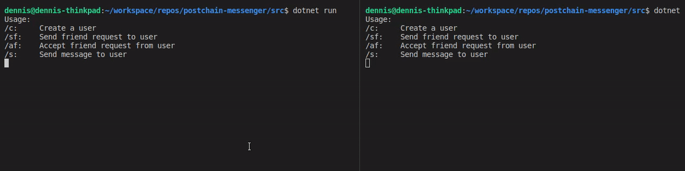

# Postchain Encrypted Messenger

This repository shows an example on how to implement a secure, end-to-end encrypted, messenger running on postchain. It is based on the [Diffie-Hellman key exchange](https://en.wikipedia.org/wiki/Diffie%E2%80%93Hellman_key_exchange) and uses [AES 256 bit](https://en.wikipedia.org/wiki/Advanced_Encryption_Standard) encryption for the messages. 

### Disclaimer: The material and information contained in this repository is for general information purposes only. I do neither claim nor guarantee that there are no security risks in this code. 

## Usage

Start the main.rell either in [Eclipse](http://rell.chromia.com/en/master/eclipse/eclipse.html) or in a terminal using the current [gist](https://bitbucket.org/chromawallet/postchain2/downloads/). Then restore the dependencies with `dotnet restore` and execute the example with `dotnet run`. 

Note: sending a friend request may take some time since it generates a new set of keys and parameters. 

